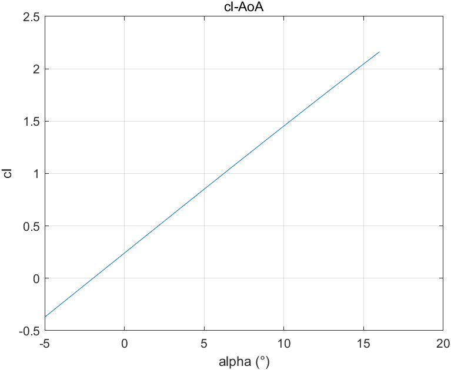
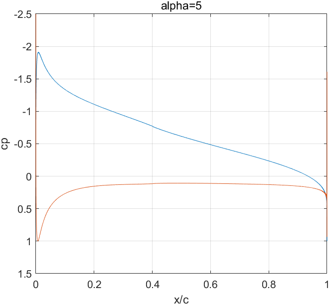

# 基于Matlab的涡板块法计算二维翼型气动

## 概述

### 涡板块法(Vortex Panel Method)

涡板块法是一种用于计算流体力学问题的数值方法，主要应用于机翼的气动力学分析。这种方法通过在固体物体的表面离散分布一系列的涡线，并假设每个涡线产生的涡旋在固体表面产生的诱导速度与实际流体的速度相匹配，从而近似地模拟流体的流动。

涡板块法的基本思想是将物体的表面分割成许多小板块，每个板块上分布有一个涡旋（涡线），这些涡旋在流场中产生诱导速度。根据库塔-儒科夫斯基定理，物体的升力可以通过计算物体表面涡旋所产生的诱导速度来求得。

## 核心算法

设 $P(x,y)$为流场中一点，则该点由第$j$​个面板诱导的速度势为
$$
\Delta \phi_ {j}=-\frac{1}{2 \pi} \int_ {j} \theta_ {p j} \gamma_ {j} d s_ {j}
\tag{1}
$$
其中，$\gamma_i$在第$j$个面板上，为仅取决于$j$​的常数，而
$$
\theta_ {pj}=\arctan\frac{y-y_ j}{x-x_ j} \tag{2}
$$
故，$P$点处由所有板块诱导的速度势为

$$
\phi(P)=-\sum_ {j=1}^{n}\frac{\gamma_ j}{2\pi}\int_ j\theta_ {pj}ds_ j \tag{3}
$$
将$P$置于第$i$个板块的控制点上，则

$$
\phi(x_ i,y_ i)=-\sum_{j=1}^n\frac{\gamma_ j}{2\pi}\int_ j\theta_ {ij}ds_ j \tag{4}
$$
板块上速度对板块的法向分量为$0$，故
$$
V_ \infty\cos\beta_ i-\sum_ {j=1}^n\frac{\gamma_ j}{2\pi}\int_ j \frac{\partial\theta_ {ij}}{\partial n_ i}ds_ j=0\\ 
其中， \beta_ i=\frac{\pi}{2}-(\alpha-\theta_ i) \tag{5}
$$
式(5)中用控制点近似替代板块，则有

$$
V_ \infty\cos\beta_ i-\sum_ {j=1}^n\frac{\gamma_ j s_ j}{2\pi}\frac{\partial\theta_ {ij}}{\partial n_ i}=0 \tag{6}
$$
由方向导数定义，有

$$
\frac{\partial \theta_ {ij}}{\partial n_ i}=\frac{1}{1+(\frac{y_ i-y_ j}{x_ i-x_ j})^2}\cdot[-\frac{y_ i-y_ j}{(x_ i-x_ j)^2}\frac{\partial x}{\partial n_ i}+\frac{1}{x_ i-x_ j} \frac{\partial y}{\partial n_ i}] \tag{7}
$$
其中，

$$
\frac{\partial x}{\partial n_i}=-\sin\theta_i \tag{8}
$$

$$
\frac{\partial y}{\partial n_i}=\cos\theta_i \tag{9}
$$

当$i=j$ 时，

$$
\frac{\partial \theta_{ij}}{\partial n_i}=0 \tag{10}
$$
上述各式构成了一个关于$\gamma_i$的n元一次方程组

此外，翼型后缘应满足库塔后缘条件，在数值计算中用两个距离极近的板块替代后缘，这两个板块应满足

$$
\gamma_i=\gamma_{i-1} \tag{11}
$$
这使得方程数量增加为n+1，而未知量仅有n个，因此需要舍弃之前的一个方程。

构成方程组：
$$
\left[
\begin{matrix}
0 & s_2\frac{\partial \theta_{1\,2}}{\partial n_1} & \cdots\ & s_{n-1}\frac{\partial \theta_{1\,n-1}}{\partial n_1}&s_n\frac{\partial \theta_{1\,n}}{\partial n_1}\\
s_1\frac{\partial \theta_{2\,1}}{\partial n_2} & 0 & \cdots &  s_{n-1}\frac{\partial \theta_{2\,n-1}}{\partial n_2} &s_{n}\frac{\partial \theta_{2\,n}}{\partial n_2} \\
\vdots & \vdots & \ddots & \vdots & \vdots\\
s_{1}\frac{\partial \theta_{n-1\,1}}{\partial n_{n-1}} & s_{2}\frac{\partial \theta_{n-1\,2}}{\partial n_{n-1}} & \cdots & 0 & s_{n}\frac{\partial \theta_{n-1\,n}}{\partial n_{n-1}}\\
1 & 0 & \cdots & 0 & 1
\end{matrix}
\right]
\left[
\begin{matrix}
\gamma_1 \\
\gamma_2 \\
\vdots \\
\gamma_{n-1}\\
\gamma_n
\end{matrix}
\right]
=
\left[
\begin{matrix}
V_\infty2\pi\cos\beta_1\\
V_\infty2\pi\cos\beta_2\\
\vdots\\
V_\infty2\pi\cos\beta_{n-1}\\
0
\end{matrix}
\right]
\\ \tag{12}
$$
在求解出$\gamma_i$后，各板块处流速有
$$
V_{si}=-\gamma_i \tag{13}
$$
因此，升力由库塔-儒科夫斯基定理给出，

$$
L'=\rho_\infty V_\infty \Gamma = -\rho_\infty V_\infty\sum_{i=1}^n\gamma_i s_i
\tag{14}
$$

$$
c_l= \frac{L'}{\frac{1}{2}\rho_\infty V_\infty^2 c} \tag{15}
$$

各板块压力系数有， 
$$
C_{pi}=1-(\frac{V_{si}}{V_\infty})^2=1-(\frac{\gamma_i}{V_\infty})^2 \tag{16}
$$


## Matlab实现

### 源代码

代码仓库：https://github.com/weilinyin/Vortex-Panel-Method-by-weilinyin

实现了低速无粘不可压流下，任意4,5,6位数NACA翼型在不同攻角、不同速度下压力系数$C_p$ 的分布与单位展长的升力$L'$ 、升力系数$c_l$ 的计算

由于篇幅限制，这里仅给出核心计算函数vortex_panel_method.m

```matlab
%% 涡板块法计算函数
%输出数据
%cp 压强系数
%l  升力
%cl 升力系数
%x  x/c
%输入数据
%n  翼型号（4 5 6位）
%alpha 攻角（°）,支持数组
%c  弦长(m)
%s  上、下翼面板块数
%v  来流速度
function[cp,l,cl,x]=vortex_panel_method(n,alpha,c,s,v)

[x_u, x_l, y_u, y_l]=naca(n,0,c,s+1,1,1);  
%构建几何形状

x_l=(fliplr(x_l))';
y_l=(fliplr(y_l))';
%下翼面坐标顺序倒置

x=[x_u'; x_l(2:end-1)];
y=[y_u'; y_l(2:end-1)];
%几何点数据合并


data=zeros(2*s-1,4);
%   预分配内存
%   x 控制点x坐标 1
%   y 控制点y坐标 2
%   length of panel 3
%   theta (rad) 板块与x轴夹角 4
%   每行为一个板块的数据

data(:,1)=(x(1:end-1)+x(2:end))./2;
data(:,2)=(y(1:end-1)+y(2:end))./2;
%根据翼型几何数据求出涡板块控制点坐标

data(:,3)=sqrt((x(1:end-1)-x(2:end)).^2+(y(1:end-1)-y(2:end)).^2);
%求出板块长度

data(:,4)=atan((y(1:end-1)-y(2:end))./(x(1:end-1)-x(2:end)));
%求出板块与x轴夹角

J=zeros(2*s-1);
%J矩阵预分配内存

x_con=(data(:,1))';
y_con=(data(:,2))';
%控制点x y坐标向量化

J=(1+((data(:,2)-y_con)./(data(:,1)-x_con)).^2).^(-1).*(sin(data(:,4)).*(data(:,2)-y_con)./(data(:,1)-x_con).^2+cos(data(:,4)).*(data(:,1)-x_con).^(-1));
%求出方向导数

b=v.*cos(pi/2-(data(:,4)-(alpha.*pi./180))).*(2*pi);
A=J.*(data(:,3))';
A(isnan(A)) = 0;
%构建方程组系数矩阵

b(s,:)=0;
A(s,:)=zeros(1,2*s-1);
A(s,s:s+1)=[1,1];
%库塔后缘条件，替代第s个方程

gamma=A\b;
%解出gamma

Gamma=zeros(2*s-1,size(alpha,2));
Gamma(1:end-1,:)=(gamma(1:end-1,:)+gamma(2:end,:))./2;
Gamma(end,:)=(gamma(end,:)+gamma(1,:))./2;
%去除噪声

l=-1.23*v*sum(gamma.*data(:,3));
%升力

cl=2*l/(1.23*v^2*c);
%升力系数

cp=1-(Gamma./v).^2;
%压力系数

x=data(:,1)./c;
%输出x/c

end
```

### 计算结果示例

#### NACA2412在$-5^\circ < \alpha < 16^\circ$ 时升力系数$c_l$ 



#### NACA2412在$\alpha=5^\circ$时的$C_p$​分布



## NVIDIA GPU加速计算

### CPU计算的局限性

当板块数量较大时，计算一个算例的时间较长


然而，GPU由于其并行计算的架构，在解决矩阵相关问题时具有天然的优势，因此这里给出一个简单利用NVIDIA GPU对求解过程进行加速的示例

### NVIDIA GPU求解示例

#### 硬件要求

Matlab中对GPU进行调用依赖NVIDIA CUDA，可使用

```matlab
gpuDevice
```

或者

```cmd
nvcc --version
```

来查看当前GPU是否支持

#### 简单调用GPU的方法

```matlab
A_gpu=gpuArray(A);%将数组存入显存中，其后续运算将全部由GPU承担
...%GPU计算
A=gather(A_gpu);%将数组转入内存
```

#### 求解速度比较

##### 使用设备

> CPU: Intel Core i9-13900KF
>
> GPU: NVIDIA Geforce RTX 4090
>
> CUDA 12.3

##### n=10000时

###### CPU


###### GPU


不难发现，在相同板块数下，GPU的求解速度要比CPU高约1倍。

然而GPU也有其局限性，在板块数更大的情况下，GPU容易显存不足

## 总结

本文介绍了一种基于Matlab的涡板块法计算二维翼型气动的数值方法。该方法通过在翼型表面分布一系列涡线，并利用库塔-儒科夫斯基定理求解各涡线强度，进而计算出翼型表面的诱导速度和压力系数分布，最终得到翼型的升力系数。Matlab代码实现了任意NACA翼型在指定攻角和来流速度下的计算，同时给出了利用NVIDIA GPU加速求解的示例。结果显示，相较于CPU，GPU在求解大规模涡线时具有更高的计算速度。然而，GPU在处理大规模问题时可能存在显存不足的局限性。总的来说，本文提供了一种计算二维翼型气动的有效数值方法，并为后续研究提供了可扩展的计算框架。
